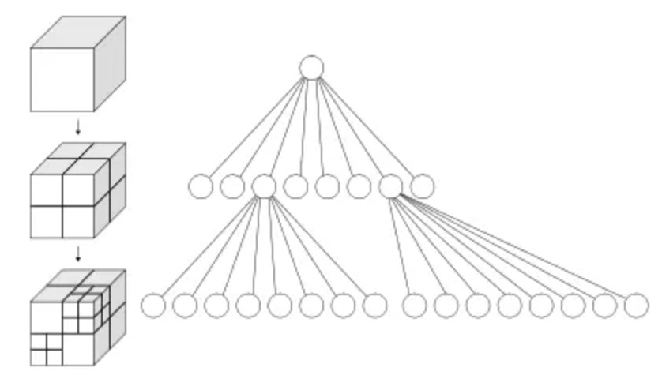
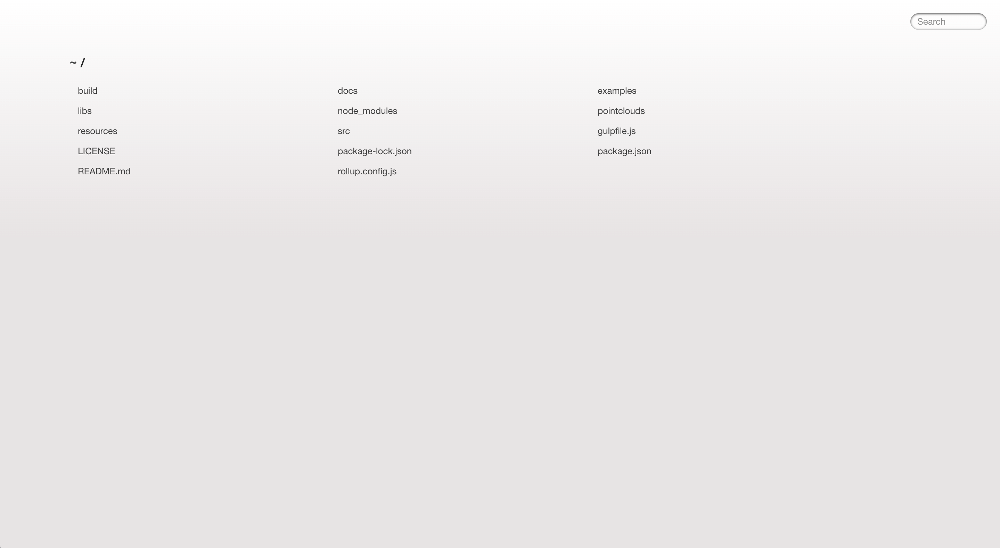
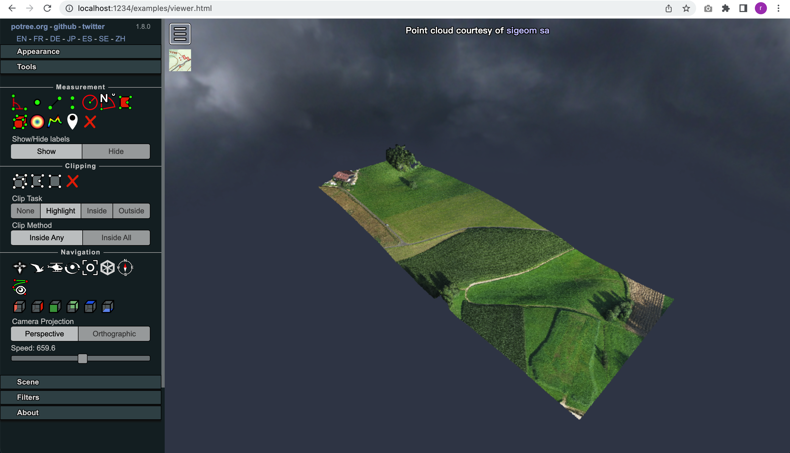

#### 什么是 Potree

- Potree 是一个基于 WebGL 的免费开源大型点云点云渲染器。它基于[TU Wien Scanopy project](https://www.cg.tuwien.ac.at/research/projects/Scanopy/) 项目和研究项目[Harvest4D](https://harvest4d.org/) [GCD Doctoral College](https://gcd.tuwien.ac.at/) 和[Superhumans](https://www.cg.tuwien.ac.at/research/projects/Superhumans/) 。
- 参考
  - [Potree: Rendering Large Point Clouds in Web Browsers](https://www.cg.tuwien.ac.at/research/publications/2016/SCHUETZ-2016-POT/SCHUETZ-2016-POT-thesis.pdf) (2016)
  - [Fast Out-of-Core Octree Generation for Massive Point Clouds](https://www.cg.tuwien.ac.at/research/publications/2020/SCHUETZ-2020-MPC/) (2020)

#### Potree 的数据结构

在运行 Potree WebGL 项目之前，我们有必要先了解一下 Potree 的数据结构。

##### Octree

Potree 的数据结构是基于 Octree 的，Octree 是一种树形数据结构，它将空间划分为八个子空间，每个子空间又可以继续划分为八个子空间，如下图所示：



Octree 的每个节点都有一个八叉树索引，它是一个三维向量，每个分量的值都是 0 或 1，表示该节点在父节点的哪个子空间中。例如，节点的八叉树索引为(0,0,0)，表示该节点在父节点的左下角子空间中。

#### 为什么要用 Octree

在传统的点云格式（las、ply、pcd 等）文件中，点云数据是按照点的顺序存储的，这种存储方式的优点是简单，缺点是无法对点云数据进行快速的空间查询。而 Octree 的优点是可以对点云数据进行快速的空间查询，缺点是需要额外的空间存储 Octree 的索引。
在 Potree 中可通过相机位置、点云距离相机的距离、点云的密度等参数来控制 Octree 的分辨率，从而达到对点云数据进行快速的空间查询的目的，并实现 LOD（Level of Detail）的功能。

#### 运行 Potree

##### 下载 Potree

```bash
git clone https://github.com/potree/potree.git
```

##### 安装依赖

```bash
cd potree
npm install
```

##### 运行 Potree

```bash
npm start
```

打开浏览器，输入`http://localhost:1234/`，即可看到 Potree 的界面。

打开 example 文件夹，即可浏览 Potree 的示例。



接下来我们打开`examples/viewer.html`示例。




此时，我们就能通过Web端查看三维点云了。在下一篇中，我们将了解如何加载自己的LAS格式点云文件。
