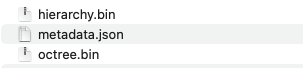
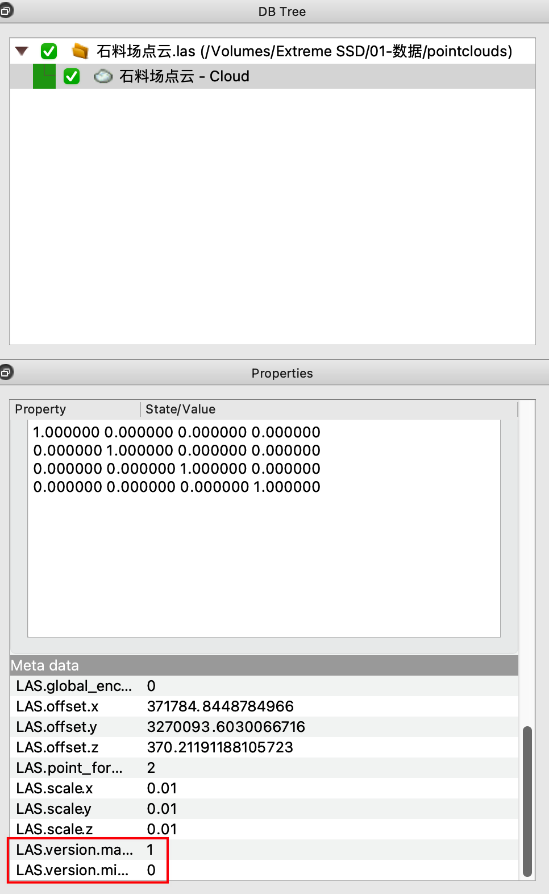

#### 如何加载自己的点云文件

在上一篇中我们讲到了Potree加载的点云格式为OCTree格式的数据结构，无法直接加载格式为LAS，LCD，PLY等格式的点云文件，所以我们需要通过PotreeConverter来将普通的点云格式文件转换为OCtree格式的点云文件。

##### 下载源码和编译

```bash
git clone https://github.com/potree/PotreeConverter.git
cd PotreeConverter
mkdir build && cd build
cmake ..
make
```

这一步通常做纯前端工作的同学可能会遇到问题，因为PotreeConverter是C++开发的，需要gcc g++编译器才可以进行编译。

如果是在Linux下，可命令行输入`sudo apt install gcc g++`进行安装。

如果是在Windows下并且没有C++编译经验，建议直接下载已编译的二进制文件[PotreeConverter_2.1.1_x64_windows.zip](https://github.com/potree/PotreeConverter/releases/download/2.1.1/PotreeConverter_2.1.1_x64_windows.zip)

##### 运行转换程序

```
PotreeConverter <input_path> -o <output_path>
```

例如：

Linux： `PotreeConverter /home/yr/test.las -o /home/yr/output`

Windows：`PotreeConverter.exe D:\\test.las -o D:\\output`

转换成功后将会得到以下文件结构




##### 在Potree中加载转换后的点云

我们打开上一篇中提到的`viewer.html`示例源码，修改加载路径为我们转换后的metadata.json文件路径。

```
// before
Potree.loadPointCloud("../pointclouds/vol_total/cloud.js", "sigeom.sa", e => {
			...
		});
		
// after
Potree.loadPointCloud("/home/yr/output/metadata.json", "sigeom.sa", e => {
			...
		});
```

此时我们在浏览器中重新打开viewer.html示例，应该就能看到我们自己的三维点云了。


注意：PotreeConverter转换LAS格式文件时，LAS文件的版本不能低于1.2。

LAS文件的版本可通过CloudCompare进行查看，下图中的LAS文件就是无法正常转换的



