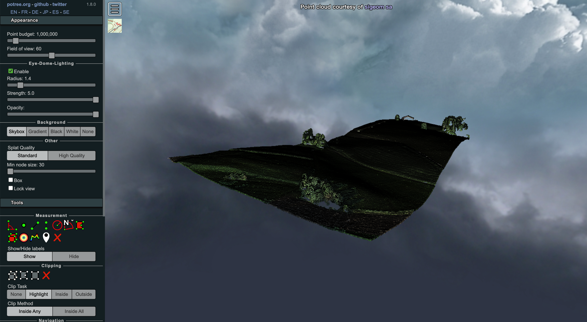

#### Potree的基本功能 -- EDL

> Eye-Dome Lighting(EDL)是一种非逼真、基于图像的着色技术，旨在改善科学可视化图像中的深度感知。它依赖于使用 GLSL 着色器在 GPU 上实现的高效后处理通道，以实现交互式渲染。仅需要投影深度信息来计算阴影函数，然后将其应用于彩色场景图像。

Potree中的EDL改编自CloudCompare源码，其主要作用是凸显点云中的深度信息。


##### 功能介绍

可通过侧边栏设置EDL相关的参数，或通过API进行设置。

​	**Enable**：开启或关闭EDL

​	**Radius**：阴影半径

​	**Strenght**：阴影强度

​	**Opacity**:：整体透明度


##### 对比

依然是`viewer.html`这个示例，下面两张图将对比出是否开启EDL的区别，图一为开启EDL，图二为关闭EDL。


很明显，图一在阴影的作用下更加的体现了三维点云在深度上的差异。


##### API

**Class：*Potree.Viewer***

**方法**：

- 开启或关闭EDL：`setEDLEnabled`
- 修改EDL阴影半径：`setEDLRadius`
- 修改EDL阴影强度：`setEDLStrength`
- 修改EDL整体透明度：`setEDLOpacity`


##### 实践

将示例`viewer.html`中EDL默认修改为开启状态，并设置强度为5.0

```javascript
// before
...
viewer.setEDLEnabled(false);
...

// after
viewer.setEDLEnabled(true);
viewer.setEDLStrength(5);
```

