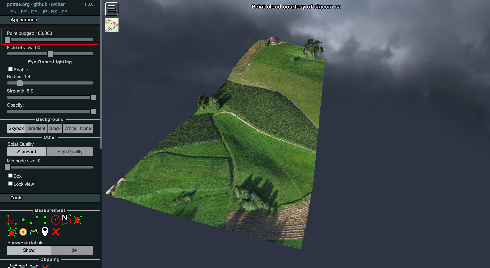
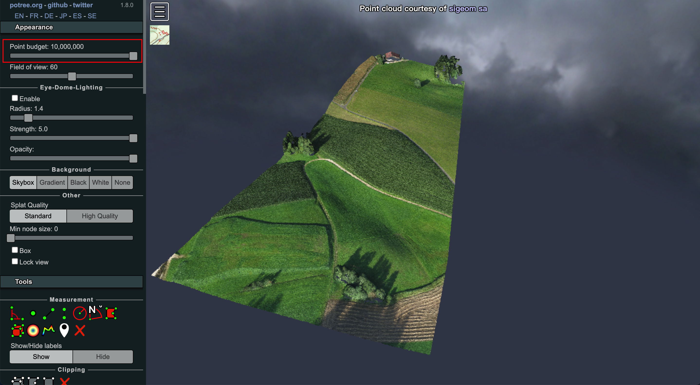
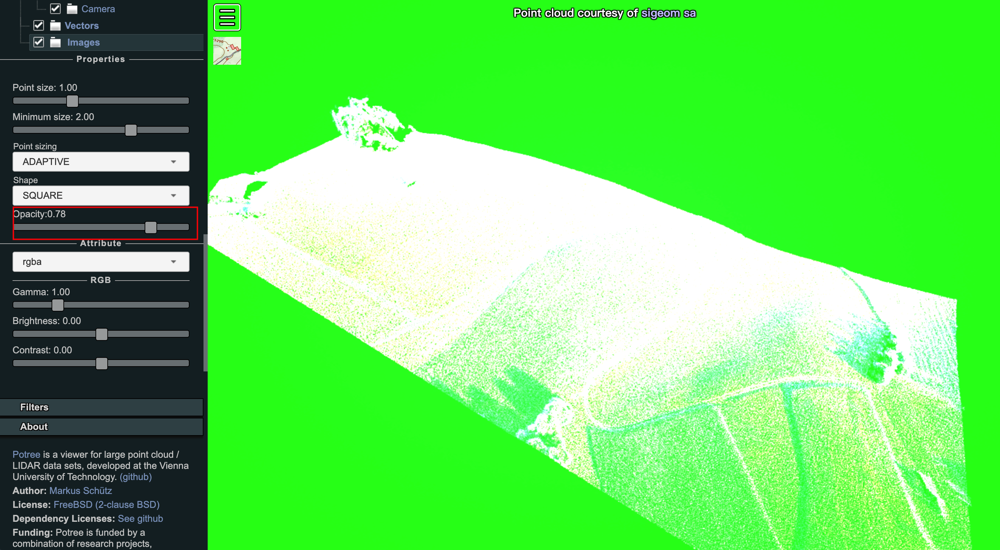

### Potree的基本功能 -- 外观设置

#### 点数量上限（Point Budget）

设置渲染的点云总点数上限，可理解为设置三维点云的“分辨率”。说白了就是最多渲染多少个点。

可看出图一的点云“分辨率”没有图二高。当然，点数量越多消耗计算机资源越多。

#### FOV（可视距离）

设置可视距离，一般60-75较为合适。

#### Background（背景）

设置背景

- 天空盒
- 渐变色
- 黑色
- 白色
- 空

**注：当关闭EDL，并且背景不为`黑色`时，若点云的透明属性 < 1，背景将会变成绿色。这时将背景设置为黑色就正常了。**

参考[issue](https://github.com/potree/potree/issues/1108#issue-1056688274)

